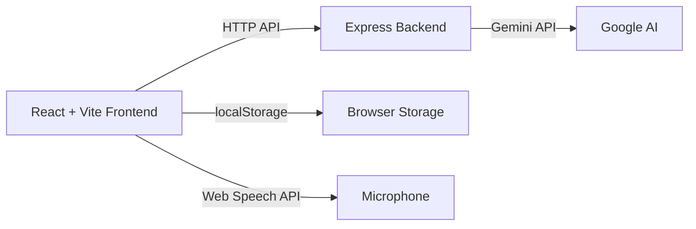

# Phase 1 — AI Communication Coach MVP

Build the foundational end-to-end flow: record speech → transcribe → analyze via Gemini → display structured review → persist locally.

## Architecture



**Frontend:** React 18 + Vite + Tailwind CSS (dark-mode-first)  
**Backend:** Node.js + Express (proxy to Gemini, keeps API key safe)  
**AI:** Google Gemini API (free tier) via `@google/generative-ai` SDK  
**Transcription:** Web Speech API (browser-native, free, no extra dependency)  
**Persistence:** localStorage for sessions, profile, and progress  

> [!IMPORTANT]
> **Web Speech API** is the zero-cost transcription strategy. It runs entirely in the browser — no paid APIs. Works best in Chrome/Edge. If the user's browser doesn't support it, a manual text-input fallback is provided.

## Proposed Changes

### Backend (`server/`)

#### [NEW] `server/package.json`
Express server with `@google/generative-ai`, `cors`, `dotenv` dependencies.

#### [NEW] `server/index.js`
- `POST /api/analyze` — accepts transcript text + session context, calls Gemini with a structured coaching prompt, returns JSON analysis.
- `POST /api/coach-cue` — lightweight endpoint for short live cues (Phase 3, stubbed now).
- CORS configured for local dev. API key read from `process.env.GEMINI_API_KEY`.

#### [NEW] `server/.env.example`
```
GEMINI_API_KEY=your_key_here
PORT=3001
```

---

### Frontend (`client/`)

#### [NEW] `client/` — Vite + React + Tailwind scaffold
Standard Vite React project with Tailwind CSS configured.

#### [NEW] Core pages (React Router)
| Page | Purpose |
|------|---------|
| **Dashboard** | Session history, streak, quick-start button |
| **Live Coach** | Mic capture + live transcript + timer |
| **Session Review** | Structured analysis display post-session |

#### [NEW] `client/src/hooks/useSpeechRecognition.js`
Custom hook wrapping Web Speech API: start/stop, interim + final transcript, error handling, fallback detection.

#### [NEW] `client/src/hooks/useSessionStore.js`
localStorage read/write for sessions, user profile, and progress metrics.

#### [NEW] `client/src/services/api.js`
Fetch wrapper calling backend `/api/analyze`.

#### [NEW] `client/src/utils/localAnalytics.js`
Client-side computation (no Gemini needed): WPM, filler-word count, word count, duration, repetition detection.

#### [NEW] Key UI components
- `Navbar` — app navigation
- `ScoreCard` — radial/bar score display
- `TranscriptViewer` — scrollable transcript with timestamps
- `SessionCard` — dashboard history item
- `CoachCue` — small coaching signal card

---

### Project Root

#### [NEW] `.gitignore`
Node modules, .env, build artifacts.

#### [NEW] `README.md`
Setup instructions.

---

## User Review Required

> [!IMPORTANT]
> **Gemini API Key required.** You'll need a free Gemini API key from [Google AI Studio](https://aistudio.google.com/apikey). The backend reads it from `server/.env`. Nothing works without it.

> [!IMPORTANT]
> **Browser requirement:** Chrome or Edge recommended for Web Speech API transcription. Firefox/Safari have limited support — the app will fall back to manual text input.

## Open Questions

1. **Do you already have a Gemini API key**, or do you need instructions to get one?
2. **Node.js version** — do you have Node.js 18+ installed? (needed for both frontend and backend)
3. **Coach personality default** — should the MVP default to "Supportive", "Direct", or "Tough"? (I'll implement all three; just need the default.)

## Verification Plan

### Automated Tests
- Backend: manual curl test of `/api/analyze` with sample transcript.
- Frontend: `npm run build` passes without errors.

### Manual Verification
Full flow test:
1. Start both servers
2. Open dashboard → click "Start Practice"
3. Grant mic → speak for 15-30 seconds → stop
4. Transcript appears → sent to backend → Gemini returns analysis
5. Session Review page renders scores, strengths, improvements
6. Return to Dashboard → session appears in history
